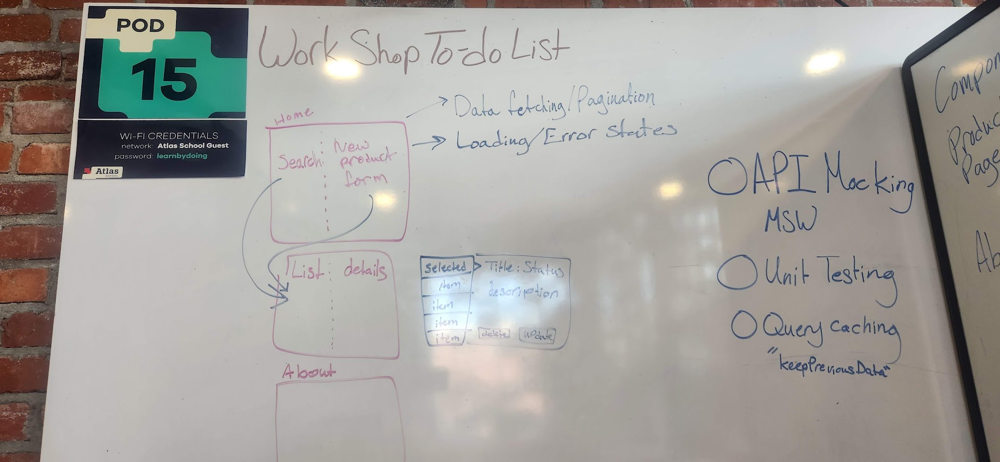

# Production Log

## 1. Project Planning and Scope

### Date: `9-23-26`

- [x] Decide on App Functionality
- [x] Wireframe Pages

App will be the queue for previous project's custom products

## 2. Reconcile the Product Vision with the Exercise Requirements

- [x] Keep the existing workshop storefront, dynamic light/dark theme, and `workshop.jpg` hero image
- [x] Define the authenticated queue as the worker-only workflow, replacing the README's generic todo list with workshop order items.
- [x] Map the README deliverables to the queue: React Query for server state, MSW for API behavior, Vitest and Testing Library for coverage, and Tailwind CSS for responsive styling.
- [x] Keep Home, About, Cart, and Products public; restrict only the queue route to authenticated workshop workers.
- [x] Scaffold files and directories
- [x] Add dependencies and packages

## 3. Establish the Queue Data Contract

- [x] Define an order item type with an id, title, description, status, created date, and completion metadata where needed.
- [x] Define the supported statuses and permitted transitions, including the completed state.
- [x] Add paginated list, detail, create, update, status update, complete, and delete request shapes.

## 4. Add Mocked Worker Authentication

- [x] Build a workshop worker login screen that matches the existing theme and uses the current visual language.
- [x] Add a mocked authentication response and a persisted worker session for local development.
- [x] Protect the queue route and redirect unauthenticated visitors to login without exposing queue data in the public navigation.
- [x] Add logout behavior and clear the worker session when requested.

## 5. Build the React Query and MSW Data Layer

- [x] Configure a global React Query client.
- [x] Add MSW handlers for authentication and queue CRUD operations.
- [x] Implement paginated queue queries with caching and `keepPreviousData` behavior.
- [x] Invalidate or update the relevant queries after create, edit, status, completion, and delete mutations.
- [ ] Add loading, error, retry, empty, and mutation-feedback states.

## 6. Implement the Worker Queue Experience

- [x] Create a responsive two-pane queue page with the item list on the left and selected-item details on the right.
- [x] Show the selected item's title, description, and order status using the existing cards, buttons, badges, spacing, and theme tokens.
- [x] Add edit controls for title and description.
- [x] Add status updates and a clear mark-as-complete action.
- [x] Add an accessible confirmation step requiring the worker to acknowledge that deletion cannot be reversed.
- [x] Add an always-visible action to open the new-item form.
- [x] Preserve the workshop hero image and dynamic theme behavior where they support the queue experience without overwhelming the work-focused layout.

## 7. Cover Responsive and Accessible Workflows

- [x] Make the queue usable on narrow screens by stacking the list and detail views without losing selection context.
- [x] Support keyboard navigation, visible focus states, labeled form controls, and screen-reader-friendly status and confirmation messaging.
- [ ] Verify light and dark themes across login, queue, forms, dialogs, loading states, and errors.

## 8. Add Automated Tests

- [x] Add Vitest and Testing Library configuration and scripts.
- [ ] Test worker login, protected-route behavior, logout, and session persistence.
- [ ] Test queue pagination, selection, loading, error, retry, and empty states.
- [x] Test create, edit, status update, completion, and irreversible-delete confirmation flows.
- [ ] Test responsive-critical rendering and accessible names for the primary controls.

## 9. Document and Verify the Deliverables

- [ ] Update the README with setup, development, test, mock API, authentication, queue, and theming instructions.
- [ ] Capture screenshots of the worker login, populated queue, loading/error states, light/dark themes, and responsive layouts.
- [x] Run lint, type-check, production build, and the full test suite.
- [ ] Confirm Home, About, Cart, and Products remain accessible publicly while the queue remains worker-only before submission.
